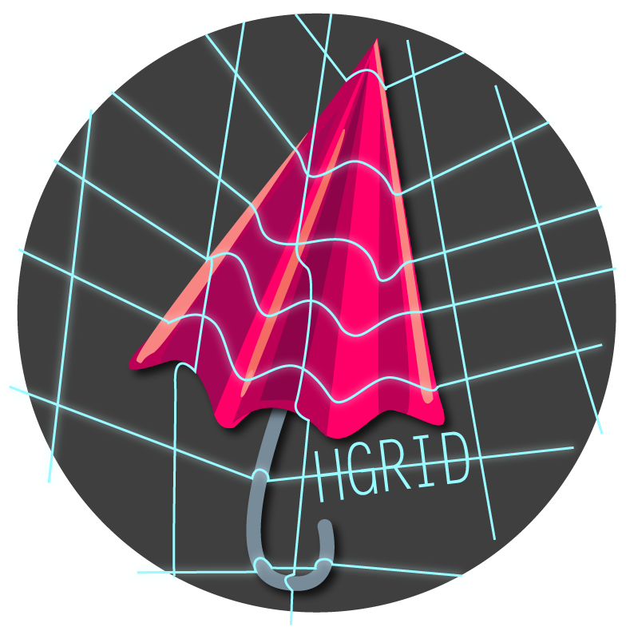

# hgrid.js

[](https://travis-ci.org/CenterForOpenScience/hgrid)



**HGrid.js** is a Javascript-based hierarchical grid that can be used to manage and organize files and folders. It allows you to create custom filebrowser widgets that can support file uploads, asynchronous loading, search, and more.

*Full documentation to come*

## Get it now

### With [bower](http://bower.io/)

```
bower install hgrid
```

### Manual download

- Standalone (includes SlickGrid): [Uncompressed](https://raw.github.com/CenterForOpenScience/hgrid/master/dist/hgrid.js) | [Minified](https://raw.github.com/CenterForOpenScience/hgrid/master/dist/hgrid.min.js)
- No bundled dependencies: [Uncompressed](https://raw.github.com/CenterForOpenScience/hgrid/master/dist/hgrid-nodeps.js) | [Minified](https://raw.github.com/CenterForOpenScience/hgrid/master/dist/hgrid-nodeps.min.js)
- hgrid.css: [Uncompressed](https://raw.github.com/CenterForOpenScience/hgrid/master/dist/hgrid.css) | [Minified](https://raw.github.com/CenterForOpenScience/hgrid/master/dist/hgrid.min.css)
- [Images](https://github.com/CenterForOpenScience/hgrid/tree/master/dist/images)

## Installation

Include jQuery and HGrid.

```html
<link rel="stylesheet" href="dist/hgrid.css" type="text/css" />
```

NOTE: The `images` directory should be in the same directory as `hgrid.css`.

```html
<script src="//code.jquery.com/jquery-1.10.2.js"></script>
<script src="path/to/hgrid.min.js"></script>
```

You can also load HGrid as an AMD module with a module loader such as [RequireJS](http://requirejs.org/). See [this wiki page](https://github.com/CenterForOpenScience/hgrid/wiki/Loading-HGrid-with-RequireJS).

## Quickstart

The input data is an array of objects with `name`, `kind` (either `"folder"` or `"item"`), and `children` properties. `children` is an array of objects of the same form.

Example:

```javascript
var files = [
    {name: 'Documents', kind: 'folder', 
    children: [
      {name: 'mydoc.txt', kind: 'item'},
    ]},
    {name: 'Music', kind: 'folder',
    children: [
      {name: 'psycho-killer.mp3', kind: 'item'}
    ]}
]
```

To create a new grid:

```javascript
var myGrid = new HGrid('#myGrid', {data: files, width: 500, height: 200});

// Or, with jQuery
$('#myGrid').hgrid({data: files, width: 500, height: 200});
```

## Loading Data From A Server

You can pass a URL to the `data` option to load JSON data from a server.

```javascript
var myGrid = new HGrid('#myGrid', {
  data: '/get/my/data'
});

// You can also pass $.ajax options
var grid = new HGrid('#myGrid' {
  data: '/get/my/data',
  ajaxOptions: {
    success: function(data) {alert('Huzzah!');}
  }
});
```

The `ajaxOptions` will be used for every request sent to the server.

### Lazy-loading 

You can lazily fetch folder contents from a server by specifying the `fetchUrl` option.

```javascript
var grid = new HGrid('#myGrid', {
  data: '/grid/data/',  // Where to get the initial data
  fetchUrl: function(folder) {
    return '/grid/data/' + folder.name;
  }
});
```


## Rows and Columns 

### Using Predefined Column Schemas

HGrid comes with a few predefined column schemas.

- `HGrid.Col.Name`: Included by default. Formats files and folders with proper indent, icon, and `name` field.
- `HGrid.Col.ActionButtons`: Provides "Download" and "Delete" buttons for files and "Upload" button for folders.

Usage:

```javascript
var grid = new HGrid('#myGrid', {
  columns: [HGrid.Col.Name,
            HGrid.Col.ActionButtons]
  ...
});
```

### Modifying Predefined Column Schemas 

```javascript
// Customize the column header text
HGrid.Col.Name.text = "Item Name"
var grid = new HGrid('#myGrid', {
  columns: [HGrid.Col.Name]
});
```

### Custom Column Schemas, Sorting

Column schemas are just objects that have--at a minimum--the following properties:

- `text`: The text to show in the column header
- `folderView`: Either a function that renders the HTML for a folder or a microtemplate.
- `itemView`: Either a function that render the HTML for a file or a microtemplate.

To make a column sortable, provide `sortable=true` and a `sortkey` on which to sort the data.

NOTE: Column schemas can additionally take any [Slickgrid column options](https://github.com/mleibman/SlickGrid/wiki/Column-Options).

Examples: 

```javascript
// Custom column schemas
var myCustomNameColumn = {
  text: 'Name', 
  folderView: '<div class="folder {{cssClass}}">{{ name }}</div?>' // Using a microtemplate
  itemView: '<div class="file {{cssClass}}">{{ name }}</div?>'
  sortable: true,
  sortkey: 'name', // property of item object on which to sort on
  indent: true  // Indent based on item depth
};

var filesizeColumn = {text: 'Filesize',
  // Using a function that receives `row` containing all the item information
  itemView: function(row) {return row.filesize.toString(); },
  folderView: function(row) {return '';} // Folders don't have a file size
  sortable: true, sortkey: 'size'
};

var grid = new HGrid('#myGrid', {
  columns: [myCustomNameColumn, filesizeColumn],
  ...
}); 
```

#### Additional schema options 

- `indent`: Either a boolean or number of pixels to indent each row. Number of indents will be calculated based on an item's depth.
- `showExpander: function(row, args)`: Boolean or function that returns a boolean whether to show the expander button or not.
- `isName`: Boolean indicating whether the column is the name column.

#### Helper functions

- `HGrid.Fmt.withIndent(row, html, [indentWidth])`: Adds an indenting span based on the a row's `depth` property.
- `HGrid.Fmt.asItem(row, html)`: Surrounds `html` with `<div class="hg-item" data-id=123>`
- `HGrid.Fmt.button(row, buttonDef)`: Render a button.
- `HGrid.Fmt.buttons(row, buttonDefs)`: Render a series of buttons.
- `HGrid.Fmt.tpl(template, data)`: Microtemplating function.


## Actions 

TODO 

## File management

TODO

```javascript
var grid = new HGrid('#myGrid', {
  data: files, 
  uploads: true,
  columns: [HGrid.Col.Name, 
            HGrid.Col.ActionButtons]  // Provides file-related buttons
                                          // (Upload, Download, Delete)
  maxFilesize: 10,  // MB
  // Mimetypes or file extensions
  acceptedFiles: ['image/*', 'application/pdf', '.py'],
  uploadMethod: function(row) {
    return row.uploadMethod || 'post';
  },
  // Can be a string or a function that returns where to send request for upload
  uploadUrl: function(row) {  // row => {id: 3, name: 'My bucket', kind: 'folder'}
    return 'files/' + row.id;
  },
  uploadHeaders: {'My-Header': 'is awesome'},
  // Returns where to send request for deletion
  deleteUrl: function(row) {
    return 'files/' + row.id + '/remove';
  },
  deleteMethod: 'delete', 
  downloadUrl: function(row) {
    return 'download/' + row.name;
  }
});
```

## Callback Options

### Event Callbacks

- `onClick: function(event, item)`: Called when the grid is clicked. If a cell is clicked, `item` will be the data object.
- `onAdd: function(item, grid)`
- `onDragover: function(event, item)`
- `onDragenter: function(event, item)`
- `onDragleave: function(event, item)`
- `onDrop: function(event, item)`
- `onSort: function(event, column, args)`: Called whenever a column header is clicked to sort the grid.
- `onExpand: function(event, item)`
- `onCollapse: function(event, item)`

### Upload-related Callbacks 

- `uploadAdded: function(file, item, folder)`
- `uploadProcessing function(file, item, folder)`: Called when a file in the upload queue begins processing.
- `uploadError: function(file, message, item, folder)`: Called when a file upload fails. By default, imputes the error message into any HTML element that has the `data-upload-errormessage` attribute.
- `uploadProgress: function(file, progress, bytesSent, item)`: Called whenever upload progress changes.
- `uploadSuccess: function(file, item, data)`: Called when an upload succeeds. `item` is the new grid item and `data` is the data returned from the server.
- `uploadComplete: function(file, item)`
- `uploadSending: function(file, item, xhr, formData)`: Called just before an upload request is made.
- `uploadAccept: function(file, folder, done)`: Validation function that is run before a file gets uploaded. `done` is a function that, if called with a string argument, raises the error message, passes it to `uploadError`, and terminates the upload. If called with no arguments, the upload is allowed. For filetype and filesize checking, use the `acceptedFiles` and `maxFilesize` options.

  ```javascript
  uploadAccept: function(file, folder, done) {
    if (file.name === 'muggle.jpg')
      done('No muggles allowed');
    done();
  }
  ```

### Permissions-related Callbacks

- `canUpload: function(folder)`: Returns a boolean whether to allow uploads to a folder.
- `uploadDenied: function(folder)`: Called when user tries to upload to a folder they don't have permission to, as determined by `canUpload`. NOTE: This gets called *before* a file gets added to the upload queue, whereas `uploadAccept` is called *after* a file is added to the queue.

### Adding other listeners

The `init` option is useful for attaching additional listeners to the grid.

```javascript
var grid = new HGrid('#myGrid', {
  data: files,
  init: function() {
    this.element.on('mycustomevent', function(event) {alert('custom event triggered')});
  }
});
```


### Other Options

- `width`: The width of the grid in px
- `height`: The height of the grid in px or "auto".
- `indent`: Width to indent items in px. Defaults to 15px.

TODO

## Styling the Grid

Default CSS Classes

- `hgrid`
- `hg-item`: Includes an item's indent spacer element, icon, and name
- `hg-btn`
- `hg-folder`
- `hg-file`: Used in `HGrid.Col.Name` to render the file icon.
- `hg-toggle`: Used in `HGrid.Col.Name` column to make an item toggle-able
- `hg-expand`
- `hg-collapse`
- `hg-row-highlight`
- `hg-upload-processing`
- `hg-upload-started`: Added to a row after a file is added and upload has started
- `hg-upload-error`: Added to a row if an error occurs during upload.


### Overriding Slickgrid or Dropzone options

You can pass initial options to the Slickgrid or Dropzone constructors like so:

```javascript
var grid = new HGrid('#myGrid', {
  data: files,
  dropzoneOptions: {
    parallelUploads: 5
  },
  slickgridOptions: {
    editable: true
  }
});
```

## Accessing SlickGrid and DropZone objects directly

```
myGrid.grid // => The Slick.Grid object 
myGrid.dropzone  // => The Dropzone object
```

## Dependencies

- [jQuery](http://jquery.com/)
- [[DropZone]](http://www.dropzonejs.com/) (if uploads are enabled)

Certain modules of [SlickGrid](https://github.com/mleibman/SlickGrid/wiki) are bundled with HGrid internally.

## Development

Hgrid depends on [NodeJS](http://nodejs.org/) for package management and [Grunt](http://gruntjs.com/) for automation.

### Getting started 

To install all development dependencies needed for development, run

    $ npm install

in the project root's root directory.

### Tests

Run tests with grunt.

    $ grunt

Tests are written using the [QUnit](http://qunitjs.com/) framework.

Tests are located in `tests/tests.js`.


### Releasing

- Bump version in bower.json
- Bump version in package.json
- Run `grunt`
- Commit to dev
- Merge to master
- Create git tag
- Push
